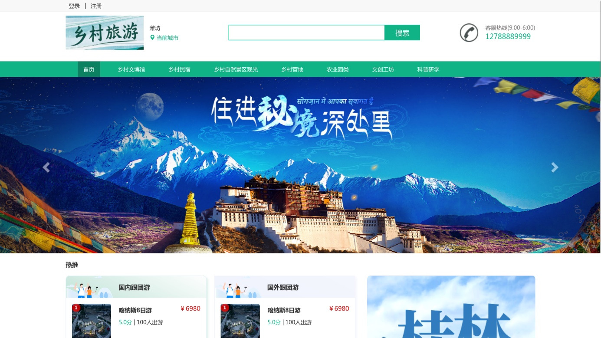
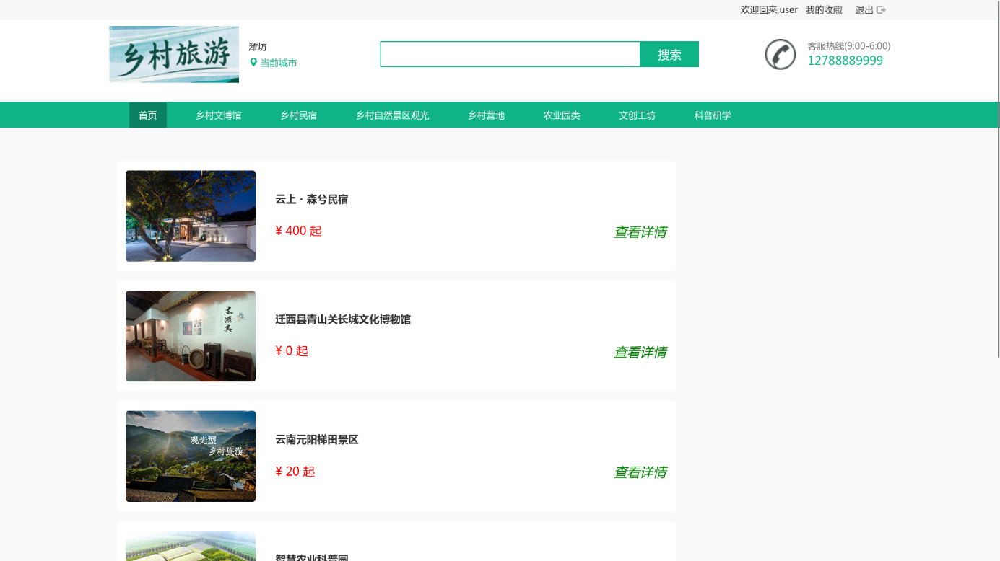
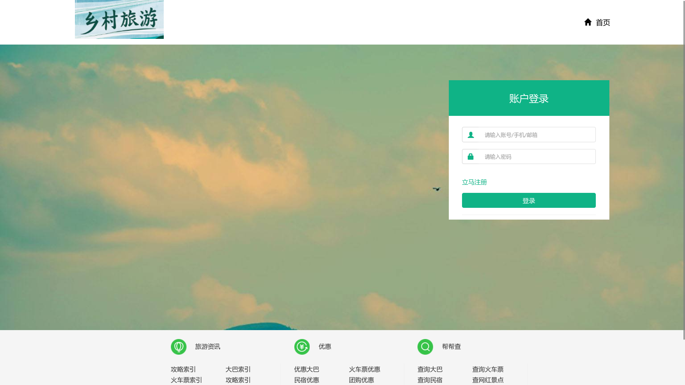
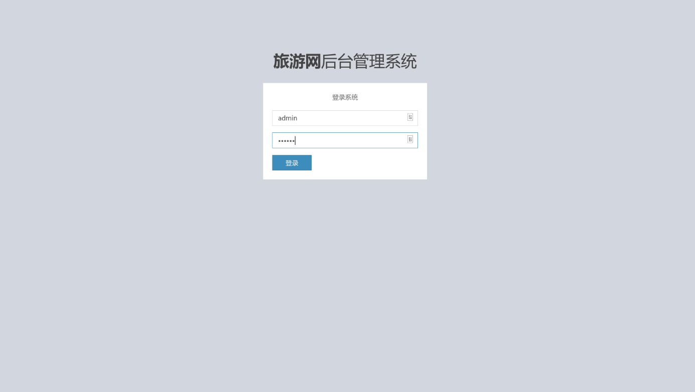
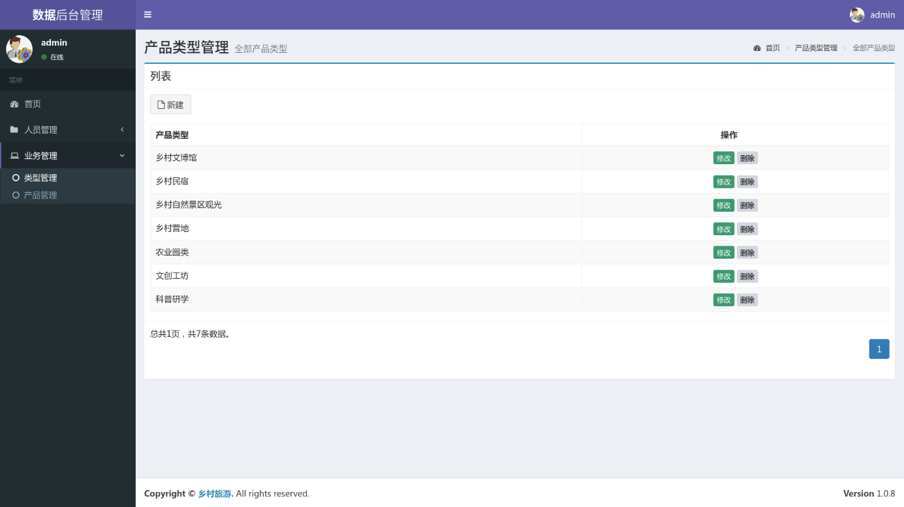
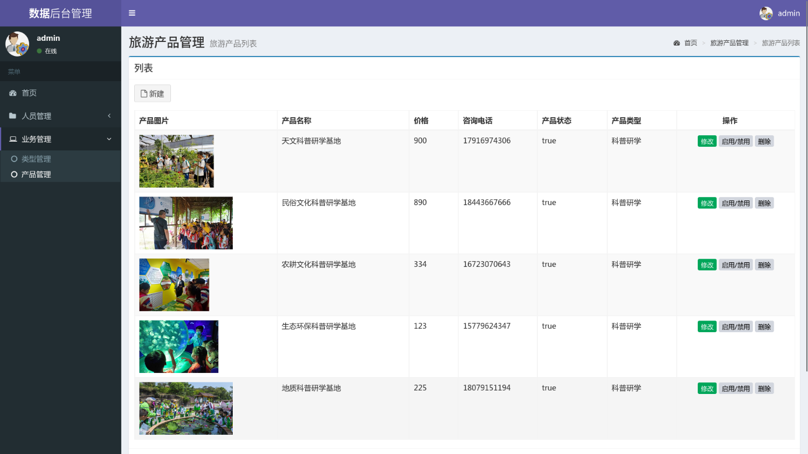

# 对 百战旅游网 bug 修复和优化


## 更改为乡村旅游系统


```
技术框架
thymeleaf + springboot

```










## 配上一个简单的论文


课程设计级别

达不到本科毕业要求的项目

[论文](./论文.docx)


## 使用
前台：http://localhost:8080/frontdesk/index
账号：user 密码 123456
后台：http://localhost:8080/backstage/index
总管理员账号：admin 密码 123456
分管理员账号：admin 密码 123456


## 已有修复bug：

1. 两个地方加删除
2. 人员展示
3. 新增管理员 需要给他分配角色role
4. 修复若干其他bug
    图片不回显的bug


### 不重要
迁移数据的时候，上传的文件在 target/classes/static/upload 下，注意要拷贝到 src/main/resources/static/upload


